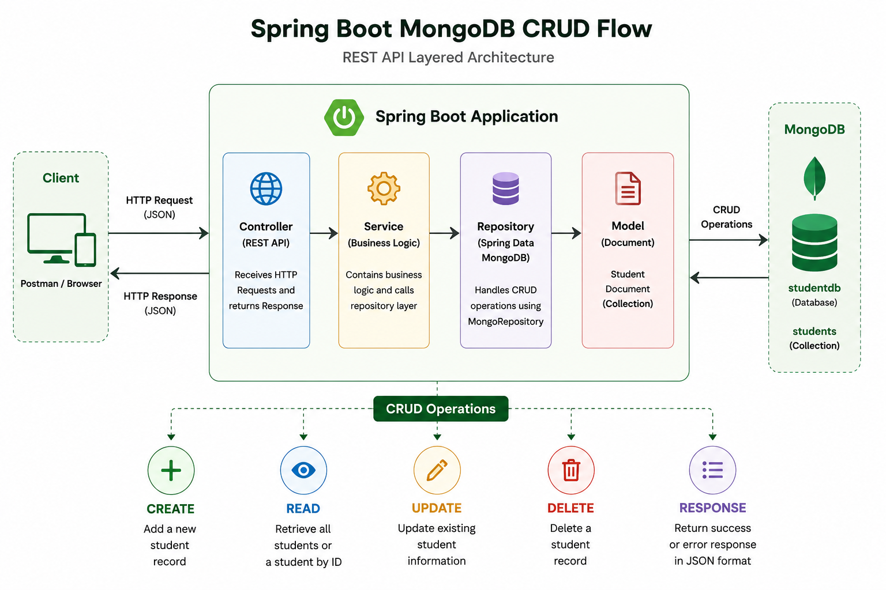
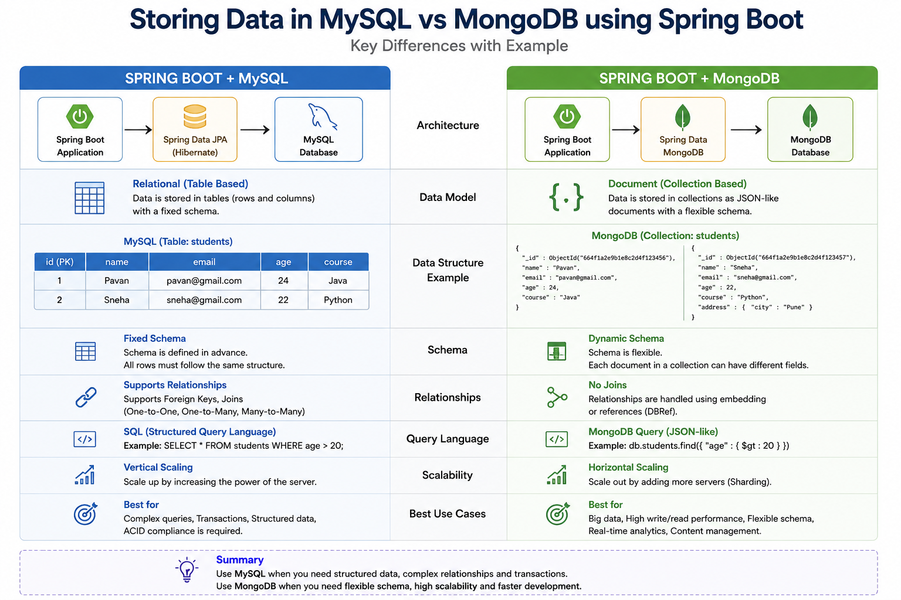

# 🍃 Spring Boot: MongoDB CRUD Operations

A Spring Boot REST API application that demonstrates **CRUD** (Create, Read, Update, Delete) operations using **MongoDB** as the database. The application uses **Spring Data MongoDB** to perform document-based data persistence and exposes RESTful APIs for managing student records.

---

## ⚙️ What This Covers

✔ Create new student records in MongoDB

✔ Retrieve all students

✔ Update existing student details

✔ Delete student records from MongoDB

✔ Input validation and standardized API responses

✔ RESTful CRUD operations using Spring Data MongoDB

---

## 🛠️ Tech Stack

| Category | Technologies |
|----------|--------------|
| **Backend** | Java 17, Spring Boot, MongoRepository |
| **Database** | MongoDB |
| **API Testing** | Postman |
| **Build Tool** | Maven |

---

## 📡 REST API Endpoints

| Method | Endpoint | Description |
| ------ | -------- | ----------- |
| POST | `/student/add-student` | Creates a new student record in MongoDB |
| GET | `/student/get-students` | Retrieves all student records |
| PUT | `/student/update-student/{id}` | Updates an existing student record |
| DELETE | `/student/delete-student/{id}` | Deletes a student record |

---

## 🚀 How it Works

  

  

  

---

## 🎯 Conclusion

👉 *This repository demonstrates how to build RESTful CRUD APIs using Spring Boot and MongoDB. It provides a practical example of document-based data persistence, Spring Data MongoDB integration, request validation, and clean REST API design.*

---

⭐ Thank You for Visiting This Repository ⭐

